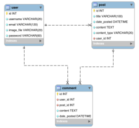

# Simple blog project

This code is based on the project developed by Corey Schafer and distributed under MIT license.
Source code can be downloaded from his [GitHub page](https://github.com/CoreyMSchafer/code_snippets/tree/master/Python/Flask_Blog/08-Posts).
His video series can be whatched on [YouTube](https://www.youtube.com/playlist?list=PL-osiE80TeTs4UjLw5MM6OjgkjFeUxCYH).

The code available in this repository was slightly modified to include:
- Selection of rendering mode of the posts (HTML, Markdown)
- Addition of comments to posts
- Addition of an [API](./flaskblog/routesapi.py) to consume the posts through REST
- A webservice testing [routine](./testwebservice.py)
- A [Dockerfile](./resources/Dockerfile) that allows you to run this code easily with all the dependencies



## Installation and execution

Once you have Anaconda installed, in your terminal, run:

```conda create --yes --name simpleblog -c conda-forge python=3.7 flask flask-sqlalchemy flask-bcrypt flask-login flask-wtf flask-markdown Pillow```

Then, you should activate the environment:

```conda activate simpleblog```

Then, you can run the project:

```python run.py```

There is one user included in the database in file `flaskblog/site.db` with username `default@test.com` and password `testing`.

To-do list:
- add count to visitors
